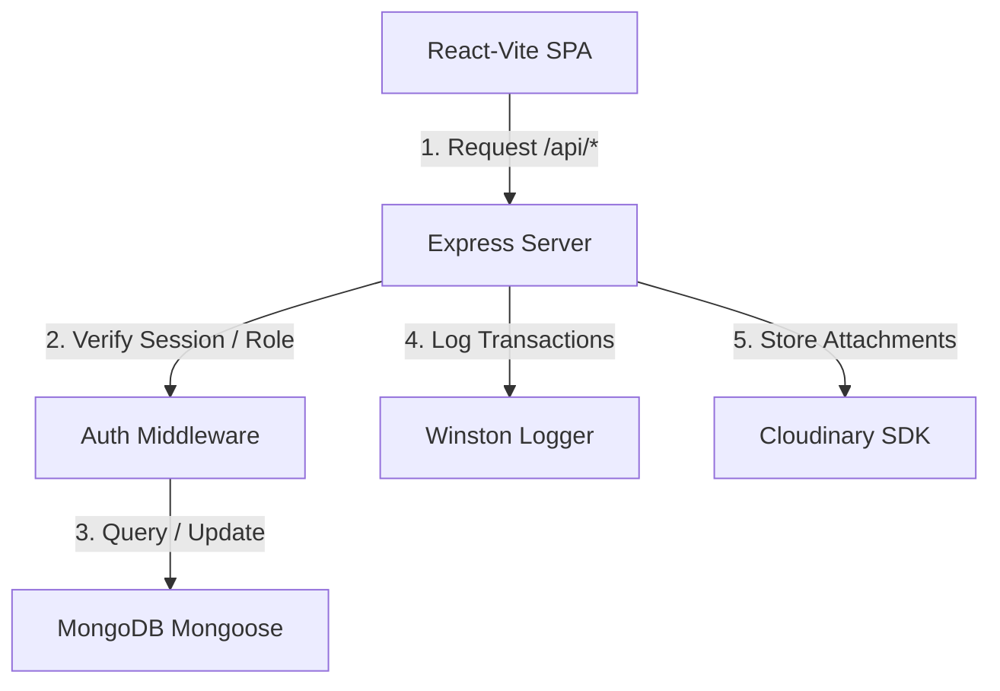

# CWF Corporation - MERN Stack Project

This repository contains the production-grade MERN stack setup for **CWF Corporation**, a waterproofing consultation and inspection business based in Pune, India.

## Project Structure

The project is structured as follows:
- `/server` - Backend API built with Node.js, Express, and MongoDB (via Mongoose).
- `/client` - Frontend Single Page Application (SPA) built with React, Vite, and React Router.
  - **Admin Dashboard**: Located within `/client` under the `/admin/*` protected route group. Access is guarded via role-based authentication (`superadmin` and `editor`).

```text
cwf_coorporation/
├── .gitignore
├── package.json
├── README.md
├── server/
│   ├── .env.example
│   ├── .prettierrc
│   ├── eslint.config.js
│   ├── package.json
│   ├── server.js
│   ├── scripts/
│   │   └── verify_models.js
│   └── src/
│       ├── config/
│       │   └── db.js
│       └── models/
│           ├── User.js
│           ├── Service.js
│           ├── Project.js
│           ├── Testimonial.js
│           ├── BlogPost.js
│           ├── Inquiry.js
│           ├── TeamMember.js
│           └── SiteSettings.js
└── client/
    ├── .env.example
    ├── .prettierrc
    ├── eslint.config.js
    ├── index.html
    ├── package.json
    ├── vite.config.js
    └── src/
        ├── main.jsx
        ├── App.jsx
        ├── components/
        ├── context/
        ├── hooks/
        ├── pages/
        │   ├── admin/
        │   └── client/
        ├── routes/
        └── utils/
```

---

## Setup and Installation

### Prerequisites
- [Node.js](https://nodejs.org/) (v18 or higher recommended)
- [MongoDB](https://www.mongodb.com/) (Local server or MongoDB Atlas cluster)

### Installation
1. Install all dependencies for the root, backend, and frontend directories:
   ```bash
   npm run install:all
   ```

2. Configure environment variables:
   - Copy `server/.env.example` to `server/.env` and fill in the required credentials (MongoDB URI, JWT secret, Cloudinary tokens, SMTP details).
   - Copy `client/.env.example` to `client/.env` and fill in the API base URL.

---

## Running the Application

### Development Mode
To start both the backend API and frontend Vite servers concurrently, run:
```bash
npm run dev
```
- Server API will start on: `http://localhost:5000` (or `PORT` specified in `.env`)
- React Client will start on: `http://localhost:5173` (Vite default)

### ESLint & Prettier
To check linting and formatting across both client and server projects:
```bash
# Run linting check
npm run lint

# Automatically format code files
npm run format
```

---

## Architecture

The project features a standard three-tier MERN architecture:



*   **Role-Based Access**: The application distinguishes between normal client inquiries and administrative dashboards using custom role verification middlewares.
*   **Audit Logging**: Core business actions are logged to file transports via Winston logger for diagnostic security.

---

## Mongoose Model Verification

We include a dry-run validation script to confirm Mongoose models compile and reference each other correctly without requiring a live MongoDB connection:

```bash
npm run verify:models
```

This is useful for local syntax checking and CI/CD verification pipelines.

---

## Environment Variables

### Backend Configuration (`server/.env`)
Required settings to run the Node.js API:

```env
PORT=5000
MONGO_URI=mongodb://localhost:27017/cwf_corporation
JWT_SECRET=change-this-to-a-secure-secret
CLOUDINARY_CLOUD_NAME=
CLOUDINARY_API_KEY=
CLOUDINARY_API_SECRET=
SMTP_HOST=smtp.gmail.com
SMTP_PORT=587
SMTP_USER=
SMTP_PASSWORD=
```

### Frontend Configuration (`client/.env`)
Specify the backend API endpoint:

```env
VITE_API_URL=http://localhost:5000/api
```

---

## API Documentation

### 1. Inquiries Endpoint
Creates a new client inspection request.

*   **Endpoint:** `/api/inquiries`
*   **Method:** `POST`
*   **Request Body:**
    ```json
    {
      "name": "John Doe",
      "email": "john@example.com",
      "phone": "+919876543210",
      "address": "Pune, India",
      "description": "Waterproofing consultation required for terrace leak."
    }
    ```
*   **Response (HTTP 201):**
    ```json
    {
      "success": true,
      "message": "Inquiry submitted successfully.",
      "inquiry_id": "60d0fe4f5311236168a109a1"
    }
    ```

### 2. Admin Authentication Endpoint
Authenticates administrative users.

*   **Endpoint:** `/api/auth/login`
*   **Method:** `POST`
*   **Request Body:**
    ```json
    {
      "email": "admin@cwf.com",
      "password": "securepassword"
    }
    ```
*   **Response (HTTP 200):**
    ```json
    {
      "success": true,
      "token": "eyJhbGciOiJIUzI1NiIsIn...",
      "user": {
        "name": "Super Admin",
        "role": "superadmin"
      }
    }
    ```

---

## Future Improvements
*   Add SMS notifications for automatic inquiry assignment.
*   Implement real-time dashboard updates using WebSockets/Socket.io.
*   Integrate PDF report generation for waterproofing inspection checklists.

---

## Author
*   **Gaurav Dwivedi** - [GitHub Profile](https://github.com/gauravdwivedi111)

---

## License
This project is licensed under the MIT License - see the LICENSE file for details.
